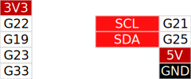

# ピンテーブル生成スクリプト

## 使い方

### 必要なライブラリのインストール

```
pip3 install --user -r requirements.txt
```

### 生成 


* サンプルのM5Stack CORE用定義 (ピン用途が定義されていない部分は列結合する)

```
python3 pin_table_gen.py pin_def_core.jsonc pin_table_colors.jsonc --span_pin_name_without_usage
```

* サンプルのATOM MATRIX用定義 (ピン用途が定義されていない部分でも列結合しない)

```
python3 pin_table_gen.py pin_def_atom_matrix.jsonc pin_table_colors.jsonc
```

もしくは、 `gen_all.py` を実行すると、サンプルの定義を一括生成します。

```
python3 gen_all.py
```

## サンプル

* M5Stack COREのピン配置


* M5Atom Matrixのピン配置




## ライセンス

Boost Software License 1.0 なので、ソースコードのライセンス表記を消さなければ変更したものの再配布等が可能です。
